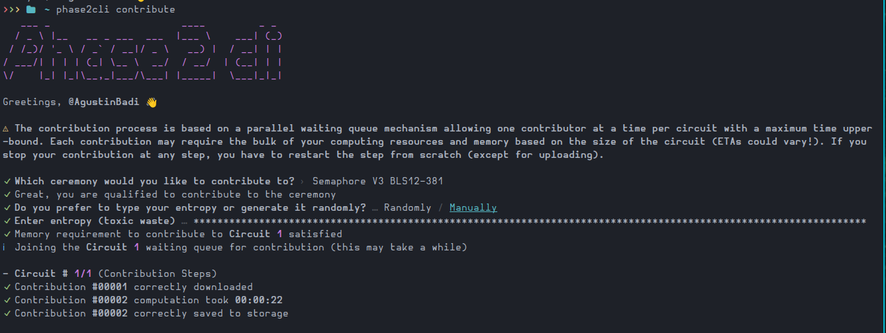

# Trusted setup ceremony contribution

This document will explain how to contribute to the phase 2 of the trusted setup ceremony conducted by modulo-p. 

### Preliminary

1. Install npm utility

Before joining the ceremony you must have installed the npm javascript utility, if you haven't installed yet you can do it by following this [documentation](https://github.com/Modulo-P/Cardano-Semaphore/blob/main/docs/Ceremony/install_npm.md) or alternativelly in the [official docs](https://docs.npmjs.com/downloading-and-installing-node-js-and-npm)

2. Have a Github account.

To contribute you must have a Github account. The account must have the following activity requirements:

* Have 1 follower.
* Following 5 accounts.
* Have at least two public github repositories.
* Be at least one month old.

### Install the phase2cli package

In order to contribute to the ceremony you must install the following npm [package](https://www.npmjs.com/package/@modulo-p/phase2cli)

```sh
npm install -g @modulo-p/phase2cli
```

### Authenticate

Before you submit your contribution, you must authenticate with your github account using the following command.

```sh
phase2cli auth
```

The application will require that you have an OAuthentication token. If you haven't one the application will recognize it, and will give an code to create the authentication token. 


Then, you must go to this [link](https://github.com/login/device), login and copy the code.


### Contribute

To start the contribution execute:

```sh
phase2cli contribute
```

There it will be asked how you are going to create the randomness that you will going to provide to the ceremony, either manually or automatically. Although, any option is valid, to make it more fun you can choose `manually`. Be creative and enter type most random characters you can.



Once that, you contribution is ready! :D

Note: Beware that by any means you must not reveal your neither preserve your random contribution. This will vulnerate the security of the protocol, if at least one participant discard they toxic waste, the ceremony is secure. 

### Share to your RSS

When your contribution is ready, a link to share your contribution on X will be displayed. We need you to share your contribution publicly so the public knows that reliable person like you contributed to this process.

Thank you!

## FAQ

**Why this ceremony is important?**

The ceremony is important because it is the mechanism that securely derives the public keys used to construct the Zero-Knowledge proof of the protocol. The multi-party computation process provides a reliable way to derive these values. The security assumption of the ceremony is that at least one honest party will discard its secret contribution. If a sufficient number of reliable people contribute to the ceremony, it is reasonable to expect that at least one contributor will behave honestly. This makes it difficult for contributors to collude, as it would require all of them to do so. If such collusion were successful, it could lead to the creation of malicious proofs, meaning that valid but false proofs could be generated, potentially tricking the verification process of the ZKP.


**How to know if software used and the process are realiable?**

The software used for the ceremony is open source and can be reviewed by looking at the repository. Additionally, there is a transcript of the contributions, and participants can verify that the digest of the challenge is being chained into the complete digest of the ceremony.


